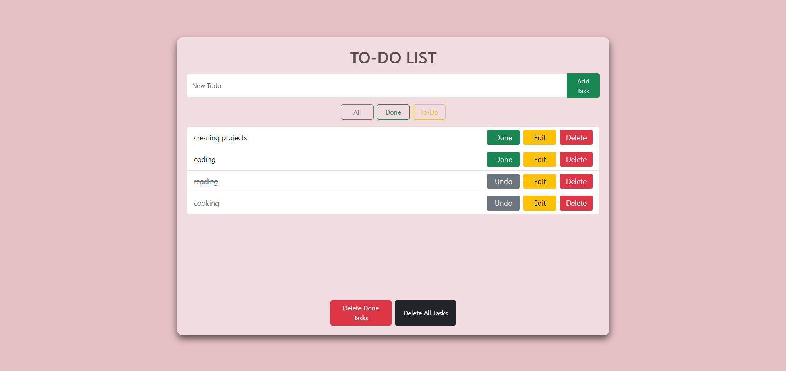

# 🗒️ To-Do List Uygulaması

Bu proje, kullanıcıların günlük görevlerini kolayca yönetebileceği sade bir To-Do List uygulamasıdır. Tek bir sayfada çalışan bu uygulama, görev ekleme, düzenleme, silme ve filtreleme gibi temel fonksiyonları sağlar. Veriler, JSON-Server ile bir JSON dosyasında saklanır ve Node.js teknolojisi kullanılan bir backend üzerinden yönetilir.

## 🛠️ Kullanılan Teknolojiler
- **HTML5** 
- **CSS3** 
- **Bootstrap 5** 
- **JavaScript** 
- **EJS** 
- **JSON-Server** 
- **Node.js** 
- **jQuery** 

## ✨ Özellikler
- **Görev Ekleme:** Yeni bir görev hızlıca eklenebilir.
- **Görev Tamamlama:** Görevler tamamlandı olarak işaretlenebilir.
- **Görev Güncelleme:** Görevlerin içeriği düzenlenebilir.
- **Görev Silme:** Tek bir görev veya toplu şekilde görevler silinebilir.
- **Filtreleme:** Görevler "All" (tümü), "Done" (tamamlanmış) ve "To-Do" (tamamlanmamış) olarak filtrelenebilir.

## 📋 Gereksinimler
- **Node.js:** Sisteminizde kurulu olmalı (`node -v` ile kontrol edebilirsiniz).
- **NPM:** Bağımlılıkları yüklemek için gerekli (`npm -v` ile kontrol edebilirsiniz).

## 🚀 Kurulum
1. **Proje Dizinine Gidin:**
   ```bash
   cd /path/to/your/TODOAPP
   ```
2. **Gerekli Paketleri Yükleyin:**
   ```bash
   npm install
   ```
3. **Uygulamayı Çalıştırın:**
   ```bash
   npm start
   ```
   - Uygulama `http://localhost:4444` adresinde çalışır.
   - Tek bir komutla hem sunucu hem de JSON-Server başlatılır.

## 📂 Proje Yapısı
```
TODOAPP/
├── public/
│   ├── css/
│   │   └── style.css       
│   ├── js/
│   │   └── todo.js         
│   └── images/
│       └── 1.jpg           
├── views/
│   └── homepage.ejs        
├── db.json                 
├── server.js               
├── todoroute.js            
└── package.json            
```

## ⚙️ API Kullanımı
JSON-Server ile:
| Yöntem  | Endpoint         | Açıklama                     |
|---------|------------------|------------------------------|
| GET     | `/api/todos`     | Tüm görevleri listele        |
| POST    | `/api/todos`     | Yeni görev ekle              |
| PUT     | `/api/todos/:id` | Görevi güncelle              |
| DELETE  | `/api/todos/:id` | Görevi sil                   |

## 📸 Ekran Görüntüleri

```

---
